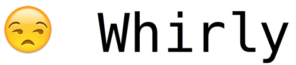

# Whirly 😀 [![[version]](https://badge.fury.io/rb/whirly.svg)](http://badge.fury.io/rb/whirly)  [![[travis]](https://travis-ci.org/janlelis/whirly.svg)](https://travis-ci.org/janlelis/whirly)

A simple, colorful and customizable terminal spinner library for Ruby. It comes with 24 custom spinners and also includes those from the [cli-spinners](https://github.com/sindresorhus/cli-spinners) project.

## Demonstration



### Bundled Whirly Spinners

[Play on asciinema](https://asciinema.org/a/88198?size=big)

### Bundled Spinners from CLI Spinners


[Play on asciinema](https://asciinema.org/a/9mlcoussb137m32swwuqtb2p1?size=big)

## Setup

Add to your `Gemfile`:

```ruby
gem 'whirly'
gem 'paint' # makes whirly colorful (recommended)
```

## Usage

### Basic Usage

The spinner is shown while the block executes:

```ruby
Whirly.start do
  # do the heavy work here
  sleep 5
end
```

You can update the spinner text from inside the block:

```ruby
Whirly.start do
  Whirly.status = "Set some text to display alongside the spinner symbol"
  sleep 3
  Whirly.status = "Update it"
  sleep 2
end
```

If you want to avoid the block syntax, you can also stop it manually:

```ruby
Whirly.start
sleep 5
Whirly.stop
```

The `start` method takes a lot of options, like which spinner to use or an initial status. See further below for the full description of available options.

```ruby
Whirly.start spinner: "pong", color: false, status: "The Game of Pong" do
  sleep 10
end
```

Also see the [examples directory](https://github.com/janlelis/whirly/tree/master/examples) for example scripts.

### Configuring Whirly

You can pass the same options you would pass to `.start` to `.configure` instead to create a persistent configuration that will be used by `.start`:

```ruby
Whirly.configure spinner: "dots"

Whirly.start do
  sleep 3 # will use dots
end

Whirly.start do
  sleep 3 # will use dots again
end
```

Call `.reset` to restore unconfigured behaviour:

```ruby
Whirly.configure spinner: "dots"

Whirly.reset

Whirly.start do
  sleep 3 # will use default spinner
end
```

## Spinners

### Included Spinners

See [`data/whirly-static-spinnes.json`](https://github.com/janlelis/whirly/blob/master/data/whirly-static-spinners.json), [`lib/whirly/spinners/whirly.rb`](https://github.com/janlelis/whirly/blob/master/lib/whirly/spinners/whirly.rb) and [cli-spinners](https://github.com/sindresorhus/cli-spinners). You can get a demonstration of all bundled spinners by running the [`examples/all_spinners.rb`](https://github.com/janlelis/whirly/blob/master/examples/all_spinners.rb) script.

## All `Whirly.start` / `Whirly.configure` Configuration Options

### Main Options

#### `spinner:`

*Default:* `"whirly"`

You have multiple ways of telling *Whirly* which spinner should be used. You can pass the following to the `spinner:` option:

- The name of a bundled spinner
- An array of spinner frames to use
- A proc which generates the frames dynamically
- A full spinner hash object ([explained below](https://github.com/janlelis/whirly#full-spinner-hash-format))

#### `status:`

*Default:* None

Allows you to directly set the first status text to display alongside the spinner icon.

#### `interval:`

*Default:* `100`

The number of milliseconds between changing to the next spinner icon frame.

### Advanced Options

#### `ambiguous_characters_width:`

*Default:* `1`

If set to `2`, ambiguous Unicode charatcers will be treated as 2 colums wide. See [unicode-display_width](https://github.com/janlelis/unicode-display_width) for more details.

#### `ansi_escape_mode:`

*Default:* `"restore"`

Can be set to `"line"` to use an different way of producing ANSI escape sequences necessary (experimental).

#### `append_newline:`

*Default:* `true`

When the Whirly block is over (or `.stop` was called), a `"\n"` will be outputted. Change to `false` to prevent this.

#### `color:`

*Default:* `!!defined?(Paint)`

This option is responsible for displaying the spinner icon in random colors. Set to `false` if you do not want this. Related option `:color_change_rate`.

#### `color_change_rate:`

*Default:* `30`

A value which describes how fast the color of the spinner icon changes.

#### `hide_cursor:`

*Default:* `true`

By default, the terminal cursor gets hidden while displaying the spinner. This also registers an `at_exit` callback, which always restores the cursor when exitting the program. If you do not want to hide the cursor, change this option to `false`.

#### `mode:`

*Default:* `"linear"`

Instructs Whirly to play the frames in a different order. Possible values: `"linear"`, `"reverse"`, `"swing"`, and `"random"`. See [spinner format section](https://github.com/janlelis/whirly#mode-1) for more details.

#### `non_tty:`

*Default:* `false`

Whirly only gets activated if the current process appears to be a real terminal. If you want to activate it for non-terimnals, set this option to `true`.

#### `position:`

*Default:* `"normal"`

You can set this to `"below"` to let Whirly appear one line below its normal position.

#### `remove_after_stop:`

*Default:* `false`

Causes the last frame to be removed after the spinner stopped.

#### `stop:`

*Default:* None

You can pass a custom frame to be used to end the animation, for example:

```ruby
Whirly.start spinner: "clock", interval: 1000, stop: "⏰" do
  sleep 12
end
```

#### `spinner_packs:`

*Default:* `[:whirly, :cli]`

Whirly comes with spinners from different sources. This options defines which sources to consider (the value refers to an uppercased child constant of `Whirly::Spinners`) and in which order.

#### `stream:`

*Default:* `$stdout`

You can pass in an [IO](https://ruby-doc.org/core-2.3.1/IO.html)-like object, if you want to display *Whirly* on an other stream than `$stdout`.

## Full Spinner Hash Format

A full spinner is defined by a hash which can have the following key-value pairs. Please note that in order to keep the format more portable, all keys are strings and not Ruby symbols. Except for `"frames"` and `"proc"`, all options are overwritable when starting/configuring Whirly. See the included spinners for example definitions of spinners.

### `"frames"`

An [Array](https://ruby-doc.org/core-2.3.1/Array.html) or [Enumerable](https://ruby-doc.org/core-2.3.1/Enumerable.html) of strings that will be used as the spinner icon.

### `"proc"`

Instead of using `"frames"`: A proc which will generate the next frame with each call.

### `"interval"`

The number of milliseconds between changing to the next spinner icon frame.

### `"mode"`

The order in which frames should be played. It can be one of the following:

- `"linear"`: Cycle through all frames in normal order
- `"reverse"`: Cycle through all frames in reverse order
- `"swing"`: Cycle through all frames in normal order, and then in reverse order, but only play first and last frame once each round
- `"random"`: Play random frames

Please note: While `"linear"` also works with frames that are just an [Enumerable](https://ruby-doc.org/core-2.3.1/Enumerable.html), all other frame modes require the object to be representable as an [Array](https://ruby-doc.org/core-2.3.1/Array.html).

### `"stop"`

A frame to be used to end the spinner icon animation.

## Remarks, Troubleshooting, Caveats

- Interval is milliseconds, but don't rely on exact timing
- Will not do anything if stream is not a real console (or `non_tty: true` is passed)
- Colors not working? Be sure to include the [paint](https://github.com/janlelis/paint/) gem in your Gemfile
- Don't set very short intervals (or it might affect performance substantly)

## MIT License

- Copyright (C) 2016 Jan Lelis <http://janlelis.com>. Released under the MIT license.
- Contains data from cli-spinners:  MIT License, Copyright (c) Sindre Sorhus <sindresorhus@gmail.com> (sindresorhus.com)
